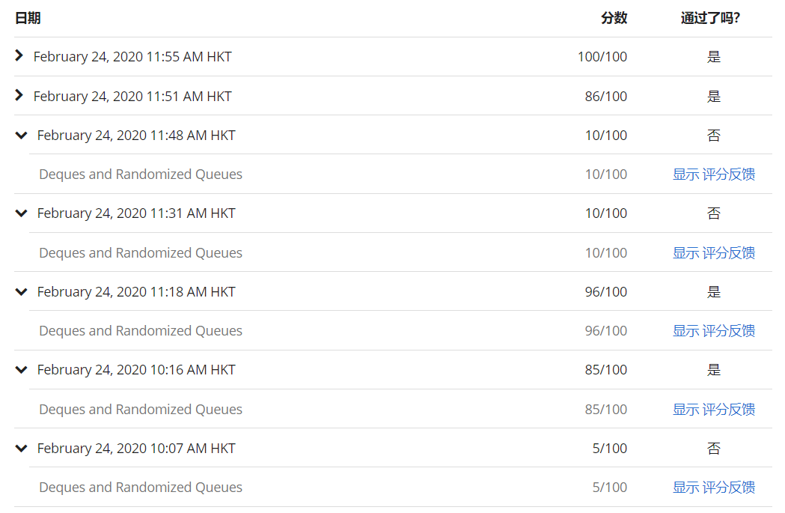

# note

### The exercise is pretty hard to pass all the tests

 ### Remain some tests didn't passed

1. check that maximum size of any or `Deque` or `RandomizedQueue` object created is equal to k.
2. Insert T items into queue; then iterate over queue and check that worst-case constant memory is allocated or deallocated per iterator operation.